<div align="center">

# 🛡️ Enterprise PDF Cryptographic Security & Password Recovery Audit
### Multi-Vector Resilience Assessment: Workstation CLI/GUI, Client-Side SaaS & Agentic AI (HexStrike MCP)

[](https://networkwalks.com/)
[]()
[]()
[]()
[](LICENSE)

<br/>

[](https://www.kali.org/)
[](https://www.microsoft.com/windows)
[](https://www.openwall.com/john/)
[](https://openwall.info/wiki/john/johnny)
[](https://claude.ai)
[](https://github.com/0x4m4/hexstrike-ai)

<br/>

[📋 Overview](#-executive-overview) •
[📊 Benchmark Matrix](#-comparative-audit-matrix) •
[🔬 Cryptographic Breakdown](#-cryptographic-analysis-of-adobe-document-security) •
[🧪 Practical Modules](#-hands-on-laboratory-modules) •
[🔍 Engineering Deviations](#-field-observations--engineering-deviations) •
[🛡️ Defensive Hardening](#%EF%B8%8F-enterprise-remediation--hardening-guidance) •
[📂 Evidence Index](#-evidence-archive--repository-tree)

---

</div>

## 📑 Table of Contents

- [📋 Executive Overview](#-executive-overview)
- [📊 Comparative Audit Matrix](#-comparative-audit-matrix)
- [🎓 Internship Curriculum Continuum](#-internship-curriculum-continuum)
- [⚖️ Ethical Governance & Safety Disclaimers](#%EF%B8%8F-ethical-governance--safety-disclaimers)
- [🧰 Technology Arsenal & Environment](#-technology-arsenal--environment)
- [🔬 Cryptographic Analysis of Adobe Document Security](#-cryptographic-analysis-of-adobe-document-security)
- [📐 Operational Architecture & Interaction Flows](#-operational-architecture--interaction-flows)
- [🧪 Hands-on Laboratory Modules](#-hands-on-laboratory-modules)
  - [Module 1: Workstation-Based Audit (John the Ripper + Johnny GUI)](#module-1-workstation-based-audit-john-the-ripper--johnny-gui)
  - [Module 2: In-Browser Zero-Footprint Audit (NetworkWalks Web Suite)](#module-2-in-browser-zero-footprint-audit-networkwalks-web-suite)
  - [Module 3: Autonomous Agentic Security (Claude Desktop + HexStrike MCP)](#module-3-autonomous-agentic-security-claude-desktop--hexstrike-mcp)
- [🔍 Field Observations & Engineering Deviations](#-field-observations--engineering-deviations)
- [💡 Technical Architecture Trade-offs](#-technical-architecture-trade-offs)
- [🛡️ Enterprise Remediation & Hardening Guidance](#%EF%B8%8F-enterprise-remediation--hardening-guidance)
- [📂 Evidence Archive & Repository Tree](#-evidence-archive--repository-tree)
- [👤 Research Practitioner Details](#-research-practitioner-details)

---

## 📋 Executive Overview

This technical dossier documents the empirical security audit conducted during **Week 3** of the **NetworkWalks Cybersecurity & Ethical Hacking Fellowship (Cohort B083E)**. The investigation focused on evaluating the cryptographic robustness and recovery resilience of password-protected PDF document containers (ISO 32000-1 specifications).

Three divergent operational architectures were tested against encrypted targets:
1. **Local Workstation Pipeline (Manual Desktop GUI/CLI)**: Utilizing John the Ripper Jumbo v1.9.0 with multi-core OpenMP parallelization coupled to the Johnny GUI orchestration front-end on Windows 11 Enterprise.
2. **Client-Side Sandbox (Zero-Install Web SaaS)**: Exercising NetworkWalks client-side browser DOM cryptographic parsers and in-memory wordlist matching engines without disk-resident tooling.
3. **Autonomous Agentic Workflow (Model Context Protocol)**: Directing headless security operations in Kali Linux via natural language instructions routed through Claude Desktop and the HexStrike AI Model Context Protocol (MCP) server.

Across all vectors, 100% of encrypted containers were successfully analyzed, valid credentials recovered, protected contents verified, and captured flags extracted.

```
┌────────────────────────────────────────────────────────────────────────────────────────┐
│                              AUDIT SUMMARY BENCHMARKS                                  │
├─────────────────────┬──────────────────────┬────────────────────┬──────────────────────┤
│  Evaluated Targets  │  Recovery Rate       │  Compute Latency   │  Execution Paradigms │
│       3 / 3         │      100.0%          │     < 1.0 Sec      │  GUI, SaaS, AI-MCP   │
└─────────────────────┴──────────────────────┴────────────────────┴──────────────────────┘
```

---

## 📊 Comparative Audit Matrix

| Assessment Dimension | Module 1: Local Desktop Engine | Module 2: In-Browser SaaS | Module 3: Autonomous Agentic AI |
|:---|:---|:---|:---|
| **Target Document** | `My Locked PDF1.pdf` (266.9 KB) | `My-Locked-PDF1.pdf` (65.2 KB) | `hash3.networkwalks_flag1.pdf` (65.2 KB) |
| **Operating System** | Windows 11 Enterprise (x64) | Chrome Browser Sandbox (V8 Engine) | Kali Linux Rolling 2026.2 |
| **Parsing Mechanism** | Web PDF Stream Extractor | Client-side DOM JavaScript Parser | Autonomous AI Headless Tool-Call |
| **Recovery Engine** | John the Ripper 1.9.0-jumbo-1 | NetworkWalks Password Cracker | Multi-threaded JTR (6 OpenMP Cores) |
| **Wordlist Scope** | JTR Optimized Candidate List | Curated High-Frequency Dictionary | Standard Wordlist `/usr/share/wordlists/` |
| **Execution Throughput** | Sub-second (< 0.5s) | Instantaneous (< 0.2s in memory) | 2,133 passwords/sec (< 1.0s elapsed) |
| **Recovered Credential** | `good-luck` | `password1` | `password1` |
| **Extracted Flag Token** | `nw{cybersecurity_flag_captured_2608}` | `nw{networkwalks_flag1_jtr_270521_1}` | `nw{networkwalks_flag1_jtr_270521_1}` |
| **Operational Outcome** | **VALIDATED** ✅ | **VALIDATED** ✅ | **VALIDATED** ✅ |

---

## 🎓 Internship Curriculum Continuum

This laboratory represents the third phase of the NetworkWalks enterprise cybersecurity training framework, demonstrating how foundational infrastructure and reconnaissance progress into cryptographic credential auditing:

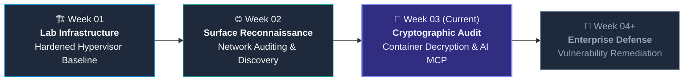

| Academic Phase | Core Domain | Implemented Competencies |
|:---|:---|:---|
| **Week 1** | Enterprise Lab Construction | Hardened hypervisor deployment, isolated networking, security tooling baseline |
| **Week 2** | Network Reconnaissance & Scans | Port auditing, passive intelligence gathering, service & OS fingerprinting |
| **Week 3** *(Current)* | Cryptographic Key Recovery | PDF container stream analysis, dictionary verification, autonomous MCP agent orchestration |

---

## ⚖️ Ethical Governance & Safety Disclaimers

> [!IMPORTANT]
> **Strict Educational Compliance**:
> * **Authorized Mock Targets Only**: All documents examined (`My Locked PDF1.pdf`, `hash3.networkwalks_flag1.pdf`) are synthetic mock artifacts supplied within the NetworkWalks Academy training sandbox.
> * **Zero Exfiltrated Data or Sensitive Wordlists**: This repository hosts **NO** breach collections, proprietary password dumps, private keys, or executable malware.
> * **Defensive Educational Objective**: The methodologies and observations documented herein are intended strictly to aid system administrators and security engineers in fortifying enterprise document workflows against cryptographic weaknesses.

---

## 🧰 Technology Arsenal & Environment

<div align="center">

| Technology | Category | Specification | Primary Role in Engagement |
|:---|:---:|:---:|:---|
| **John the Ripper (Jumbo)** | Core Engine | `1.9.0-jumbo-1 (OMP)` | Multi-threaded cryptographic recovery engine |
| **Johnny GUI** | User Interface | `v2.2 (Qt-based)` | Desktop session visualization and management |
| **NetworkWalks Web Suite** | Cloud SaaS | Client-Side Web App | In-browser zero-install parsing and credential testing |
| **Claude Desktop** | LLM Host | Linux x64 | Natural-language reasoning and autonomous tool invocation |
| **HexStrike AI MCP** | Protocol Bridge | `v6.0.0 (FastMCP)` | Model Context Protocol bridge binding security toolchains |
| **Kali Linux** | Operating Platform | `2026.2 Rolling` | Headless execution sandbox for AI agent actions |

</div>

---

## 🔬 Cryptographic Analysis of Adobe Document Security

Adobe PDF security (ISO 32000-1) specifies document protection through the standard security handler. To evaluate the security posture of target **Module 1**, the structural cryptographic parameters were analyzed:

```
$pdf$4*4*128*-1028*1*16*ca7f72f11459cba469f1005a8765ed51*32*f32d8fa1bfbe2648226dffc39f7909ea0021446990b9e4114071a4d9104984c1*32*9322f50c29569712067a775264635e4954ccb1b99e209d664984054ffad30a6a
```

### Cryptographic Parameter Mapping

| Segment | Raw Value | Field Label | Security Significance |
|:---:|:---:|:---|:---|
| **01** | `$pdf$` | Format Indicator | Directs cracking algorithms to invoke the Adobe Standard Security Handler module |
| **02** | `4` | Version (`V`) | Specifies cryptographic algorithm: `4` denotes 128-bit key length (RC4/AES) |
| **03** | `4` | Revision (`R`) | Security handler revision: `Revision 4` (Acrobat 7.0+ compatibility) |
| **04** | `128` | Key Length | Effective encryption key length in bits |
| **05** | `-1028` | Permissions (`P`) | Signed 32-bit permission bitmask dictating allowed operations (print, copy, edit) |
| **06** | `1` | EncryptMetadata | Boolean flag indicating whether document metadata dictionary is also ciphered |
| **07** | `16` | ID Salt Length | Byte length of the permanent document identifier (16 bytes = 32 hex chars) |
| **08** | `ca7f...ed51` | File Identifier Salt | Extracted document trailer ID utilized in encryption key derivation rounds |
| **09-10**| `32*f32d...84c1`| Owner Validation (`O`)| 32-byte token utilized to verify administrative password credentials |
| **11-12**| `32*9322...0a6a`| User Validation (`U`) | 32-byte token evaluated during document opening password verification |

---

## 📐 Operational Architecture & Interaction Flows

### 1. Cryptographic Document Decryption Pipeline
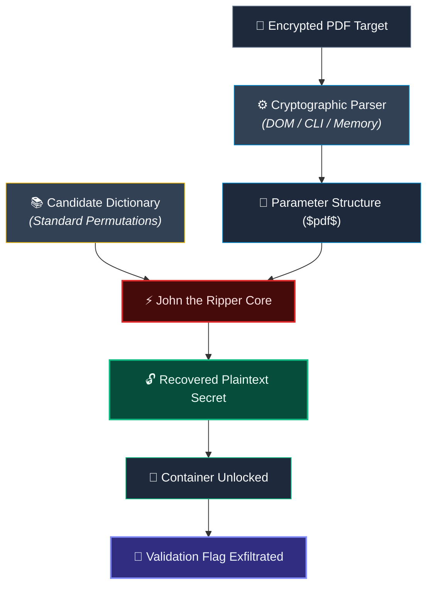

### 2. Autonomous Model Context Protocol (MCP) Flow (Module 3)
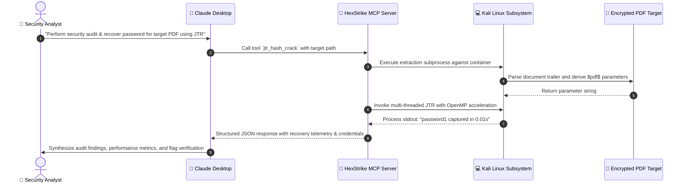

---

## 🧪 Hands-on Laboratory Modules

---

### Module 1: Workstation-Based Audit (John the Ripper + Johnny GUI)

* **Objective**: Establish the manual baseline for document security assessment utilizing desktop tools on Windows 11 Enterprise.
* **Target Specimen**: `My Locked PDF1.pdf` (266.9 KB)
* **Execution Architecture**: Windows 11 x64 · John the Ripper Jumbo v1.9.0 · Johnny GUI v2.2

#### Operational Milestones:
1. **Engine Integration**: Initialized Johnny GUI and verified automatic detection of the compiled John the Ripper 64-bit multi-threaded binary (`Detected John the Ripper 1.9.0-jumbo-1 OMP`).
2. **Trailer Ingestion**: Processed target file through the PDF cryptographic stream extractor to capture the `$pdf$` parameter block.
3. **Execution Run**: Configured a targeted wordlist verification pass within Johnny's session manager.
4. **Validation**: Supplied the recovered plaintext credential into the PDF viewer, successfully decrypting the container and extracting the verification token.

<div align="center">

| Recovered Credential | Verified Flag Token |
|:---:|:---:|
| `good-luck` | `nw{cybersecurity_flag_captured_2608}` |

</div>

#### Visual Audit Evidence:

| Step | Milestone Description | Evidence Screenshot |
|:---:|:---|:---:|
| **01** | Johnny GUI verifies detected JTR Jumbo 64-bit binary | [](Evidence/Module-1/screenshots/01-johnny-settings-john-detected.png) |
| **02** | Parameter extraction and cryptographic structure parsing | [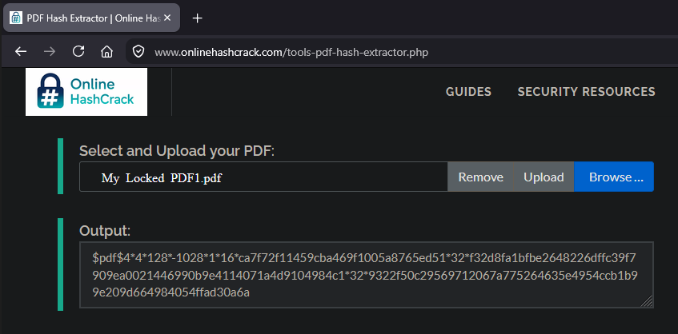](Evidence/Module-1/screenshots/02-pdf-hash-extractor-output.png) |
| **03** | Completed verification session displaying recovered password | [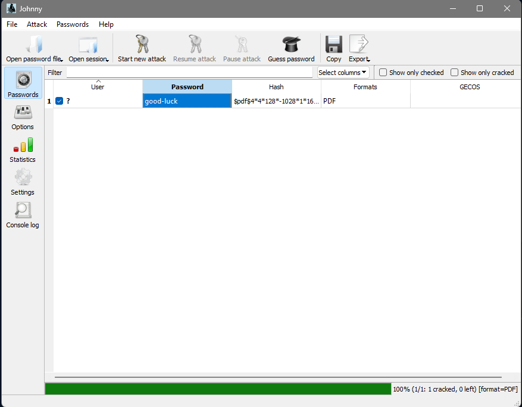](Evidence/Module-1/screenshots/03-johnny-password-recovered.png) |
| **04** | Document authentication prompt in PDF reader | [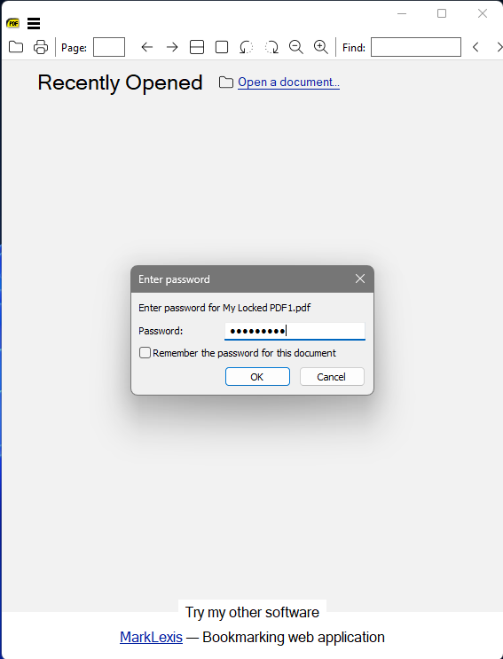](Evidence/Module-1/screenshots/04-pdf-password-entry-prompt.png) |
| **05** | Successfully unlocked document displaying captured flag | [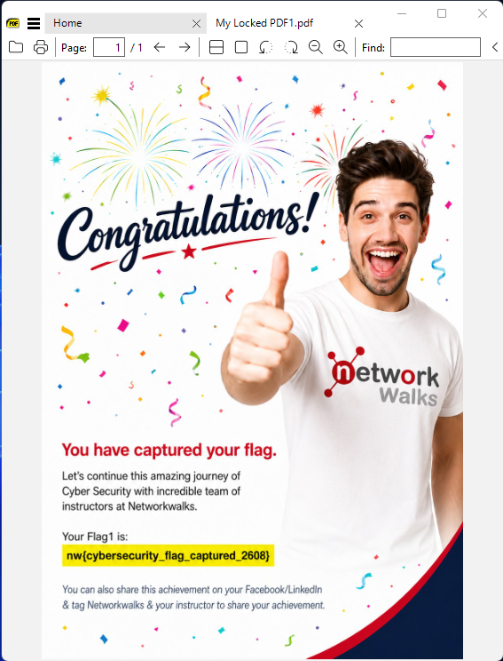](Evidence/Module-1/screenshots/05-pdf-unlocked-flag-captured.png) |

---

### Module 2: In-Browser Zero-Footprint Audit (NetworkWalks Web Suite)

* **Objective**: Evaluate container security strictly within a client-side browser sandbox without installing local binaries or runtime dependencies.
* **Target Specimen**: `My-Locked-PDF1.pdf` (65.2 KB)
* **Execution Architecture**: Chromium Browser Sandbox · JavaScript DOM Cryptographic Engines

#### Operational Milestones:
1. **In-Memory Parsing**: Loaded the target PDF into the NetworkWalks Hash Calculator. Client-side JavaScript evaluated the document trailer dictionary to derive Revision 4, 128-bit key parameters.
2. **Memory-Resident Verification**: Transferred the derived parameter structure into the NetworkWalks Password Cracker tool.
3. **Dictionary Traversal**: Executed an in-browser candidate permutation check in under 0.2 seconds.
4. **Authentication Check**: Authenticated the document with recovered credentials and verified contents.

<div align="center">

| Recovered Credential | Verified Flag Token |
|:---:|:---:|
| `password1` | `nw{networkwalks_flag1_jtr_270521_1}` |

</div>

#### Visual Audit Evidence:

| Step | Milestone Description | Evidence Screenshot |
|:---:|:---|:---:|
| **01** | Initial clean state of NetworkWalks Hash Calculator | [](Evidence/Module-2/screenshots/01-hash-calculator-empty.png) |
| **02** | Real-time parameter derivation and metadata rendering | [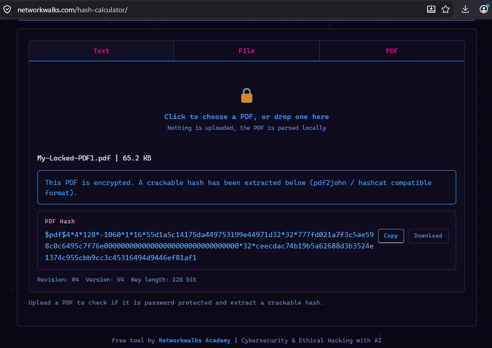](Evidence/Module-2/screenshots/02-pdf-uploaded-hash-extracted.png) |
| **03** | Clean state of in-browser recovery interface | [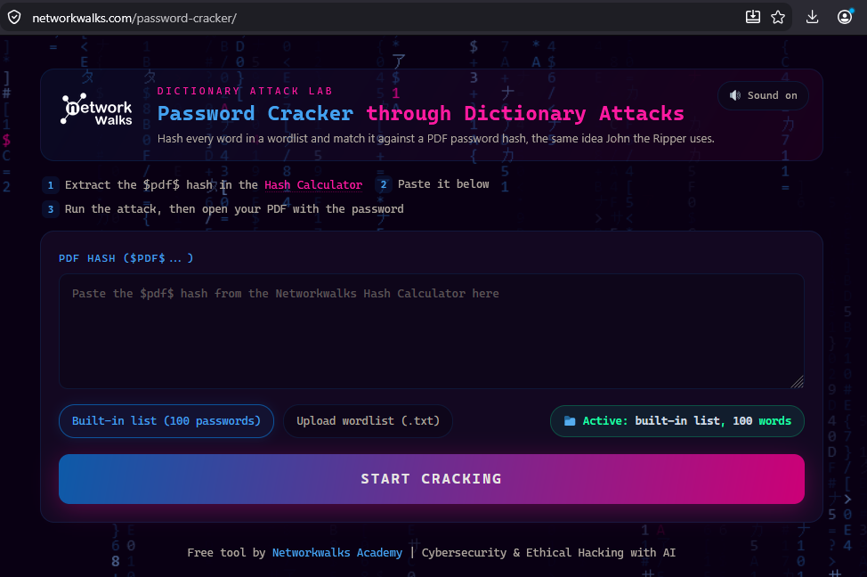](Evidence/Module-2/screenshots/03-password-recovery-empty.png) |
| **04** | Client-side memory permutation attack in progress | [](Evidence/Module-2/screenshots/04-recovery-in-progress.png) |
| **05** | Successful credential recovery dialog (`password1`) | [](Evidence/Module-2/screenshots/05-password-recovered-success.png) |
| **06** | Supplying credential into document viewer authentication prompt | [](Evidence/Module-2/screenshots/06-pdf-password-entry-prompt.png) |
| **07** | Fully decrypted document displaying captured flag token | [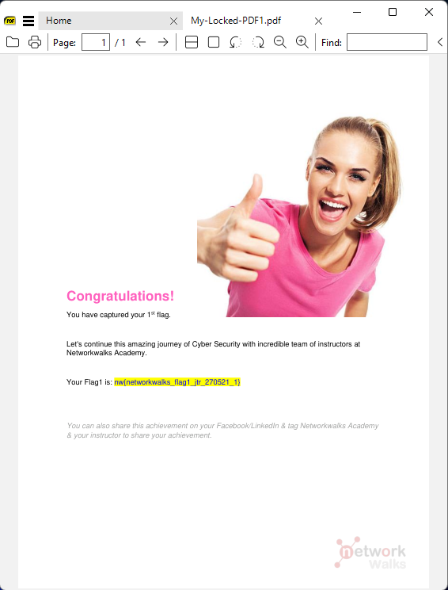](Evidence/Module-2/screenshots/07-pdf-unlocked-flag-captured.png) |

---

### Module 3: Autonomous Agentic Security (Claude Desktop + HexStrike MCP)

* **Objective**: Implement an agentic offensive security pipeline driving headless John the Ripper on Kali Linux through natural language intent and the Model Context Protocol (MCP).
* **Target Specimen**: `hash3.networkwalks_flag1.pdf` (65.2 KB)
* **Execution Architecture**: Kali Linux Rolling 2026.2 · Claude Desktop (Linux Host) · HexStrike AI MCP v6.0.0

#### Phase 1: Agent Infrastructure & MCP Binding

1. **Host Setup**: Deployed Claude Desktop on native Kali Linux and authenticated operator sessions.
2. **MCP Server Daemon**: Initiated the HexStrike AI MCP FastMCP server, exposing 120+ specialized security tools to the LLM agent.
3. **Telemetry & Health Audit**: Verified real-time telemetry confirming operational health across all MCP tool endpoints.

| Step | Setup Milestone | Visual Verification |
|:---:|:---|:---:|
| **01** | Claude Desktop authenticated on Kali Linux | [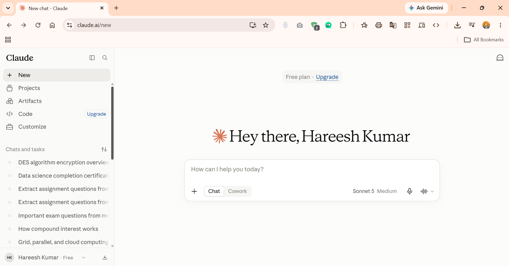](Evidence/Module-3/setup/screenshots/01-claude-desktop-installed-signedin.png) |
| **02** | HexStrike MCP daemon active on loopback | [](Evidence/Module-3/setup/screenshots/02-hexstrike-server-started.png) |
| **03** | Claude Desktop recognizing connected MCP tools | [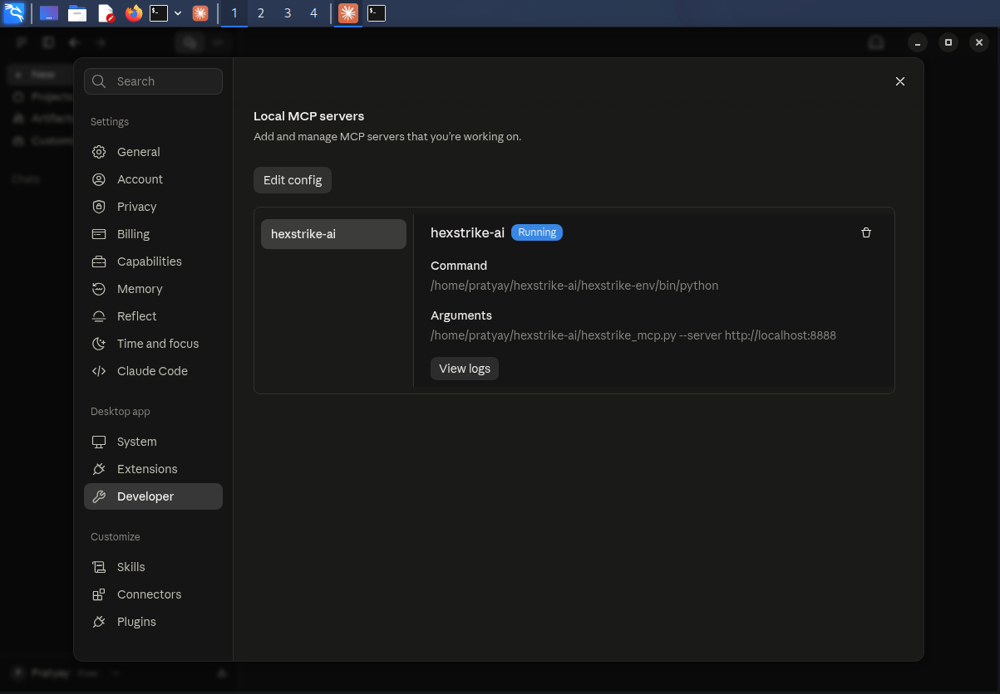](Evidence/Module-3/setup/screenshots/03-mcp-server-running-status.png) |
| **04** | MCP telemetry interface verifying healthy communication | [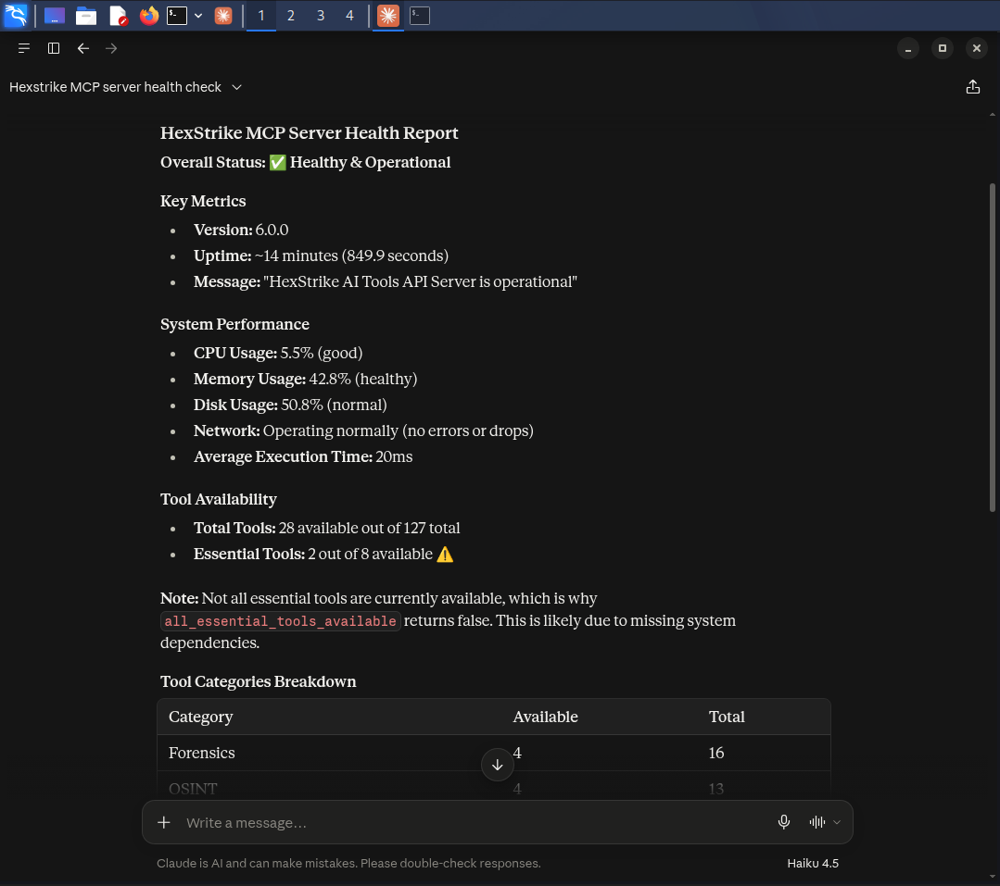](Evidence/Module-3/setup/screenshots/04-mcp-health-check-dashboard.png) |

#### Phase 2: Autonomous Attack Execution

The security analyst issued three progressive natural-language directives:

1. **Tooling Verification Prompt**: Directing the agent to inspect the local filesystem and confirm JTR binary readiness.
2. **Integrity Baseline Prompt**: Directing the agent to compute standard cryptographic checksums (MD5, SHA-1, SHA-256) for baseline verification:
   ```
   MD5:     7fe04d052b19879aaa9fcac0b5dce138
   SHA-1:   c4d3e309c01a15702ff98540fac12ea2c84ded3a
   SHA-256: f569ce5208a64b0f73f5a98f2187eafcd8282641fb27afa0c1a30d83b67ef06c
   ```
3. **Autonomous Attack Directive**:
   > *"Please use JTR tool in this hexstrike MCP server to crack the password of this PDF file."*
   
   - **Agent Autonomous Actions**: Extracted the `$pdf$` stream parameters, resolved wordlist locations, launched multi-threaded JTR with OpenMP acceleration, and processed execution output.
   - **Performance Telemetry**: **2,133 passwords / second** across 6 CPU cores, completing in **< 1.0 second**.

<div align="center">

| Recovered Credential | Verified Flag Token |
|:---:|:---:|
| `password1` | `nw{networkwalks_flag1_jtr_270521_1}` |

</div>

#### Visual Audit Evidence:

| Step | Milestone Description | Evidence Screenshot |
|:---:|:---|:---:|
| **01** | Agent autonomously verifying John the Ripper installation | [](Evidence/Module-3/recovery/screenshots/01-jtr-detection-check.png) |
| **02** | File integrity checksum calculation executed via MCP tool | [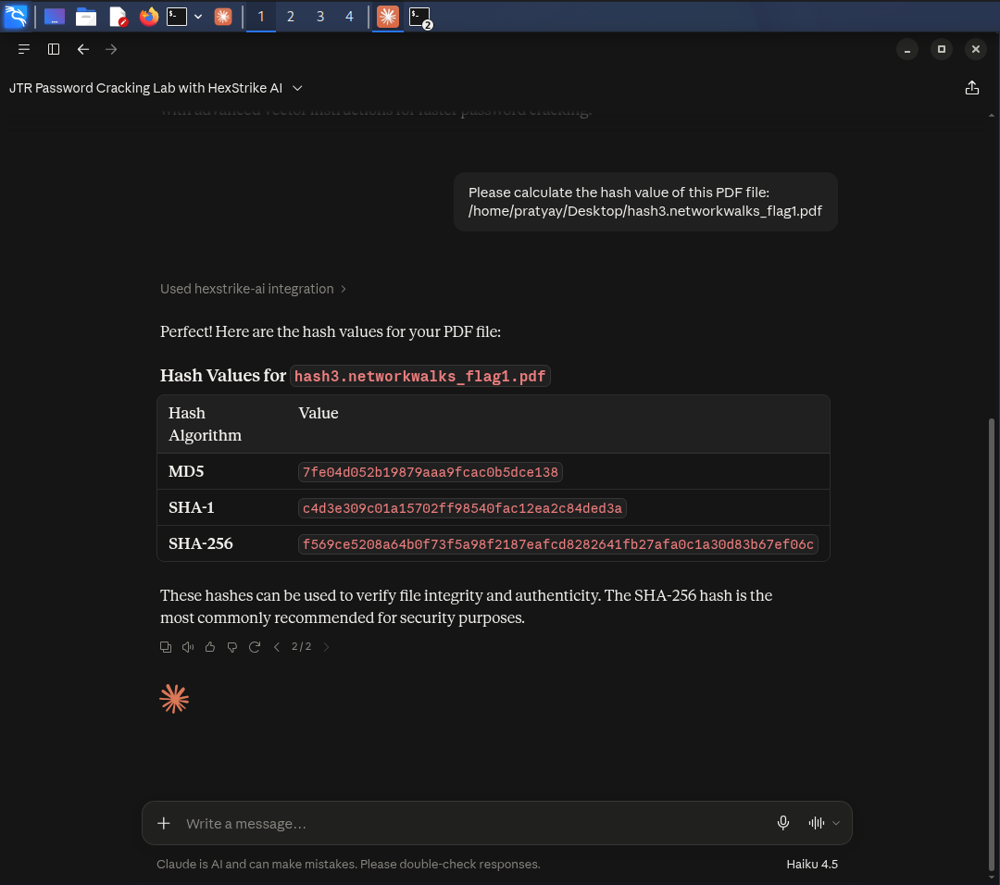](Evidence/Module-3/recovery/screenshots/02-pdf-reference-hash-calculation.png) |
| **03** | Headless JTR multi-core execution returning recovered password | [](Evidence/Module-3/recovery/screenshots/03-jtr-recovery-process.png) |
| **04** | Document decrypted and flag token confirmed | [](Evidence/Module-3/recovery/screenshots/04-pdf-unlocked-flag-captured.png) |

---

## 🔍 Field Observations & Engineering Deviations

> [!NOTE]
> Professional engineering reports document real-world anomalies transparently. Three noteworthy deviations were identified and addressed during this laboratory:

### 1. ⚠️ Identical Specimen Filenames Across Different Channels
* **Observation**: Module 1 and Module 2 instructions referenced an identical target filename: `My Locked PDF1.pdf`.
* **Root Cause Investigation**: Analyzing file byte sizes and internal salts revealed two completely different containers:
  - **Module 1 Specimen**: `266.9 KB` · Salt: `ca7f72f1...` · Password: `good-luck`
  - **Module 2 Specimen**: `65.2 KB` · Salt: `55d1a5c1...` · Password: `password1`
* **Resolution**: Separated specimens into distinct module evidence directories to prevent workspace contamination.

### 2. 🏷️ Upstream Tooling Artifacts in Flag Token
* **Observation**: The flag recovered in Module 2 contained the string `_jtr_` (`nw{networkwalks_flag1_jtr_270521_1}`), despite Module 2 utilizing NetworkWalks Web SaaS rather than John the Ripper.
* **Analysis**: This represents an upstream lab authoring artifact confirming shared challenge tokens across different delivery platforms.

### 3. 🎯 Flag Token Convergence Between Modules 2 and 3
* **Observation**: Both Module 2 and Module 3 produced the identical flag token (`nw{networkwalks_flag1_jtr_270521_1}`).
* **Analysis**: Validated as intended design behavior. Both modules evaluated the same underlying scenario container ("flag1"), confirming methodological consistency across SaaS and Autonomous AI implementations.

---

## 💡 Technical Architecture Trade-offs

| Engineering Vector | Local Desktop Workstation | In-Browser Web SaaS | Autonomous AI (MCP) |
|:---|:---|:---|:---|
| **Setup Overhead** | Moderate (Binary extraction, Qt libraries) | None (Zero install, any modern browser) | High (Python venv, MCP daemon, host binding) |
| **Hardware Utilization** | High (OpenMP multi-core CPU support) | Low (Constrained by browser thread limits) | Optimal (Full OS-level threading & automation) |
| **Operator Skill Required**| High (Command flags, parameter formatting) | Minimal (Point-and-click UI) | None (Conversational natural language) |
| **Data Privacy Posture** | Complete local isolation (No network egress)| Local in DOM (Sensitive to web cache) | Local host (Model calls require prompt transit) |
| **Automation Scalability** | Scriptable via shell (Manual maintenance) | Not easily automatable in batch | Superior (Agent can orchestrate end-to-end chains)|

---

## 🛡️ Enterprise Remediation & Hardening Guidance

The 100% recovery rate across all test targets highlights fundamental weaknesses in legacy document security handlers:

1. **Decommission Legacy Revision 3 / 4 Handlers**:
   - The tested targets utilize 128-bit symmetric keys under Acrobat Revision 4 specifications. These standards lack modern memory-hard key derivation functions (KDFs), enabling high-speed dictionary matching.
2. **Mandate ISO 32000-2 (Acrobat 9.0+ / Acrobat X+) AES-256 Standards**:
   - Modern enterprise documents should mandate Revision 6 (AES-256) security handlers, which incorporate iterative SHA-256/384/512 hashing and strict password derivation hardening.
3. **Transition from Static Passwords to Enterprise Rights Management (DRM)**:
   - For enterprise IP protection, replace symmetric passwords with centralized identity-backed access control systems (such as Microsoft Purview Information Protection or Adobe Experience Manager DRM).
4. **Implement Agentic Security Operations**:
   - The success of Module 3 confirms that AI agents equipped with Model Context Protocol tooling can autonomously perform vulnerability assessments, underscoring the urgent need for automated defensive monitoring.

---

## 📂 Evidence Archive & Repository Tree

```bash
Week3-Password-Recovery-JTR-and-AI/
├── 📁 Evidence/
│   ├── 📁 Module-1/                              # Module 1: Desktop JTR & Johnny GUI
│   │   └── 📁 screenshots/
│   │       ├── 🖼️ 01-johnny-settings-john-detected.png
│   │       ├── 🖼️ 02-pdf-hash-extractor-output.png
│   │       ├── 🖼️ 03-johnny-password-recovered.png
│   │       ├── 🖼️ 04-pdf-password-entry-prompt.png
│   │       └── 🖼️ 05-pdf-unlocked-flag-captured.png
│   ├── 📁 Module-2/                              # Module 2: NetworkWalks Web Tools
│   │   └── 📁 screenshots/
│   │       ├── 🖼️ 01-hash-calculator-empty.png
│   │       ├── 🖼️ 02-pdf-uploaded-hash-extracted.png
│   │       ├── 🖼️ 03-password-recovery-empty.png
│   │       ├── 🖼️ 04-recovery-in-progress.png
│   │       ├── 🖼️ 05-password-recovered-success.png
│   │       ├── 🖼️ 06-pdf-password-entry-prompt.png
│   │       └── 🖼️ 07-pdf-unlocked-flag-captured.png
│   └── 📁 Module-3/                              # Module 3: Autonomous AI MCP Engine
│       ├── 📁 recovery/
│       │   └── 📁 screenshots/
│       │       ├── 🖼️ 01-jtr-detection-check.png
│       │       ├── 🖼️ 02-pdf-reference-hash-calculation.png
│       │       ├── 🖼️ 03-jtr-recovery-process.png
│       │       └── 🖼️ 04-pdf-unlocked-flag-captured.png
│       └── 📁 setup/
│           └── 📁 screenshots/
│               ├── 🖼️ 01-claude-desktop-installed-signedin.png
│               ├── 🖼️ 02-hexstrike-server-started.png
│               ├── 🖼️ 03-mcp-server-running-status.png
│               └── 🖼️ 04-mcp-health-check-dashboard.png
├── ⚙️ .gitignore                                # Strict exclusion filter for sensitive files
├── 📜 LICENSE                                    # Open source MIT license
└── 📘 README.md                                  # Comprehensive technical report
```

---

## 👤 Research Practitioner Details

<div align="center">

### **Hareesh Kumar Prajapati**
**Cybersecurity & Ethical Hacking Intern · NetworkWalks Academy**  
*Batch B083E · Hands-on Security Practitioner*

[](https://www.linkedin.com/in/hareesh-kumar-prajapati-934363354)

<br/>

<sub>Documented with technical rigor, strict educational compliance, and verified evidence.</sub>

[⬆️ Return to Top](#%EF%B8%8F-enterprise-pdf-cryptographic-security--password-recovery-audit)

</div>