<div align="center">

# 🛡️ PDF Password Recovery & Security Testing Lab
### Week 3 Lab Report: Using Desktop Tools, Web Tools & AI Agent to Recover Encrypted PDF Passwords

[](https://networkwalks.com/)
[]()
[]()
[]()
[](LICENSE)

<br/>

[](https://www.kali.org/)
[](https://www.microsoft.com/windows)
[](https://www.openwall.com/john/)
[](https://openwall.info/wiki/john/johnny)
[](https://claude.ai)
[](https://github.com/0x4m4/hexstrike-ai)

<br/>

[📋 Summary](#-summary) •
[📊 Results Table](#-results-comparison) •
[🔬 How PDF Encryption Works](#-how-pdf-encryption-works) •
[🧪 Lab Modules](#-lab-modules-step-by-step) •
[🔍 Things I Noticed](#-things-i-noticed-during-the-lab) •
[🛡️ How to Make PDFs Safer](#%EF%B8%8F-how-to-make-pdfs-safer) •
[📂 Folder Structure](#-folder-structure)

---

</div>

## 📖 Introduction

Hello! My name is **Hareesh Kumar Prajapati** and I am a cybersecurity intern at **NetworkWalks Academy (Batch B083E)**. This repository is my **Week 3 Lab Report** where I worked on **PDF Password Recovery**.

In this lab, I was given locked (password-protected) PDF files and my task was to recover the passwords using different tools and methods. I used three different approaches:

- **Module 1** — A desktop tool called **John the Ripper** with the **Johnny GUI** on my Windows PC.
- **Module 2** — A web-based tool on the **NetworkWalks website** that runs directly in the browser.
- **Module 3** — An **AI agent (Claude Desktop)** connected to the **HexStrike MCP server** on Kali Linux, where I just gave instructions in simple English and the AI did everything on its own.

All three methods successfully recovered the passwords in less than 1 second, and I was able to open every PDF and capture the flags inside. This lab taught me how weak passwords can be easily recovered, and why strong encryption and passwords are so important for document security.

> **Note**: All PDF files used in this lab are practice/mock files provided by NetworkWalks Academy for educational purposes only. No real or private data was used.

---

## 📑 Table of Contents

- [📋 Summary](#-summary)
- [📊 Results Comparison](#-results-comparison)
- [🎓 Internship Progress So Far](#-internship-progress-so-far)
- [⚖️ Important Safety Notice](#%EF%B8%8F-important-safety-notice)
- [🧰 Tools & Software Used](#-tools--software-used)
- [🔬 How PDF Encryption Works](#-how-pdf-encryption-works)
- [📐 How the Recovery Process Works](#-how-the-recovery-process-works)
- [🧪 Lab Modules Step by Step](#-lab-modules-step-by-step)
  - [Module 1: Desktop Tool (John the Ripper + Johnny GUI)](#module-1-desktop-tool-john-the-ripper--johnny-gui)
  - [Module 2: Web-Based Tool (NetworkWalks Website)](#module-2-web-based-tool-networkwalks-website)
  - [Module 3: AI Agent (Claude Desktop + HexStrike MCP)](#module-3-ai-agent-claude-desktop--hexstrike-mcp)
- [🔍 Things I Noticed During the Lab](#-things-i-noticed-during-the-lab)
- [💡 Comparing the Three Methods](#-comparing-the-three-methods)
- [🛡️ How to Make PDFs Safer](#%EF%B8%8F-how-to-make-pdfs-safer)
- [📂 Folder Structure](#-folder-structure)
- [👤 About Me](#-about-me)

---

## 📋 Summary

This is my **Week 3 lab report** for the **NetworkWalks Cybersecurity Internship (Batch B083E)**. In this lab, I learned how to test the security of password-protected PDF files by trying to recover their passwords.

I used **three different methods** to do this:

1. **Desktop Software (Module 1)**: I installed John the Ripper and Johnny GUI on my Windows PC and used them to recover the PDF password manually.
2. **Web-Based Tool (Module 2)**: I used the NetworkWalks website tools directly in my browser — no software installation needed.
3. **AI Agent (Module 3)**: I used Claude Desktop with the HexStrike MCP server on Kali Linux. I just typed what I wanted in plain English, and the AI did everything automatically.

**Result**: All three methods successfully recovered the passwords and I was able to open every PDF and capture the flags inside.

```
┌────────────────────────────────────────────────────────────────────────────────┐
│                            QUICK RESULTS                                      │
├──────────────────┬────────────────┬──────────────────┬────────────────────────┤
│  PDFs Tested     │  Success Rate  │  Time Taken      │  Methods Used          │
│     3 / 3        │    100%        │  Less than 1 sec │  Desktop, Web, AI      │
└──────────────────┴────────────────┴──────────────────┴────────────────────────┘
```

---

## 📊 Results Comparison

| What | Module 1: Desktop Tool | Module 2: Web Tool | Module 3: AI Agent |
|:---|:---|:---|:---|
| **PDF File** | `My Locked PDF1.pdf` (266.9 KB) | `My-Locked-PDF1.pdf` (65.2 KB) | `hash3.networkwalks_flag1.pdf` (65.2 KB) |
| **OS Used** | Windows 11 | Browser (Chrome) | Kali Linux |
| **How I Got the Hash** | Online PDF Hash Extractor | NetworkWalks Hash Calculator | AI did it automatically |
| **Tool Used to Recover** | John the Ripper + Johnny GUI | NetworkWalks Password Recovery | JTR via AI Agent (6 CPU cores) |
| **Wordlist Used** | JTR Default Wordlist | Built-in Top 100 Passwords | Standard Linux Wordlist |
| **Speed** | Less than 1 second | Less than 1 second | 2,133 passwords/sec, under 1 sec |
| **Password Found** | `good-luck` | `password1` | `password1` |
| **Flag Captured** | `nw{cybersecurity_flag_captured_2608}` | `nw{networkwalks_flag1_jtr_270521_1}` | `nw{networkwalks_flag1_jtr_270521_1}` |
| **Status** | **SUCCESS** ✅ | **SUCCESS** ✅ | **SUCCESS** ✅ |

---

## 🎓 Internship Progress So Far

This is the third week of my cybersecurity internship. Each week builds on the previous one:

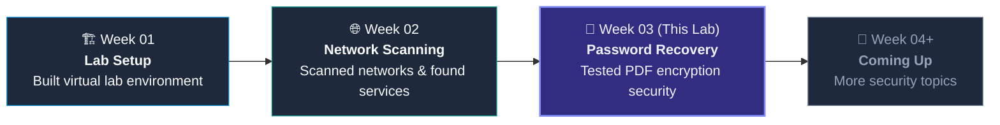

| Week | What I Learned | Key Skills |
|:---|:---|:---|
| **Week 1** | Setting Up a Cyber Lab | Installed VMs, configured networks, set up security tools |
| **Week 2** | Network Scanning | Scanned ports, found running services, identified operating systems |
| **Week 3** *(This Lab)* | Password Recovery | Extracted PDF hashes, tested passwords using wordlists, used AI to automate the process |

---

## ⚖️ Important Safety Notice

> [!IMPORTANT]
> **This is only for learning purposes:**
> * **Test files only**: All the PDF files I tested were practice files provided by NetworkWalks Academy. No real or private files were used.
> * **No sensitive data uploaded**: This repository does NOT contain any password lists, private keys, or harmful software.
> * **Educational goal**: The purpose is to understand how weak passwords can be recovered, so we can learn how to protect documents better.

---

## 🧰 Tools & Software Used

<div align="center">

| Tool | Version | What It Does |
|:---|:---:|:---|
| **John the Ripper (Jumbo)** | `1.9.0-jumbo-1` | Tries different passwords against a hash to find the correct one |
| **Johnny GUI** | `v2.2` | A graphical interface that makes John the Ripper easier to use |
| **NetworkWalks Hash Calculator** | Web App | Extracts the password hash from a PDF file directly in the browser |
| **NetworkWalks Password Recovery** | Web App | Tests common passwords against a hash in the browser |
| **Claude Desktop** | Linux | An AI assistant that can run security tools through conversation |
| **HexStrike AI MCP Server** | `v6.0.0` | Connects Claude Desktop to 120+ security tools on Kali Linux |
| **Kali Linux** | `2026.2` | A Linux system built for cybersecurity testing |

</div>

---

## 🔬 How PDF Encryption Works

When you set a password on a PDF file, Adobe saves the password in a special encoded format (called a hash) inside the file. Here is an example of what a PDF hash looks like:

```
$pdf$4*4*128*-1028*1*16*ca7f72f11459cba469f1005a8765ed51*32*f32d8fa1bfbe2648226dffc39f7909ea...*32*9322f50c29569712067a775264635e49...
```

### What Each Part Means

| Part | Value | What It Tells Us |
|:---:|:---:|:---|
| `$pdf$` | Format tag | Tells the tool that this is a PDF password hash |
| `4` | Version | The encryption method used (Version 4 = 128-bit encryption) |
| `4` | Revision | Which Adobe security standard was used (Revision 4 = Acrobat 7+) |
| `128` | Key Length | The encryption key is 128 bits long |
| `-1028` | Permissions | What actions are allowed (printing, copying, editing) |
| `1` | Encrypt Metadata | Whether the file info is also encrypted (1 = yes) |
| `16` | Salt Length | The length of the unique file ID used in encryption |
| `ca7f...ed51` | File ID | A unique identifier for this specific PDF file |
| `f32d...84c1` | Owner Hash | The encoded version of the owner/admin password |
| `9322...0a6a` | User Hash | The encoded version of the user/open password (this is what we test against) |

**In simple words**: The tool extracts this hash from the PDF, then tries thousands of passwords from a wordlist. When a password matches the hash, the PDF can be opened.

---

## 📐 How the Recovery Process Works

### Step-by-Step Flow
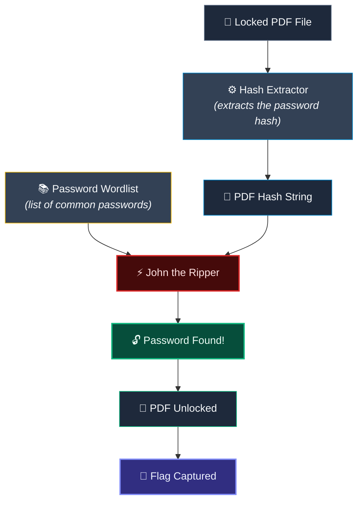

### How the AI Agent Works (Module 3)
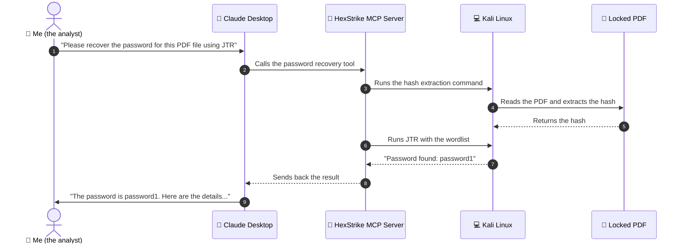

---

## 🧪 Lab Modules Step by Step

---

### Module 1: Desktop Tool (John the Ripper + Johnny GUI)

* **Goal**: Recover a PDF password using software installed on my Windows PC.
* **PDF File**: `My Locked PDF1.pdf` (266.9 KB)
* **System**: Windows 11

#### What I Did:
1. **Set up the tool**: Extracted John the Ripper files and opened Johnny GUI. It automatically detected the JTR binary and showed: `Detected John the Ripper 1.9.0-jumbo-1 OMP`.
2. **Extracted the hash**: Used an online PDF hash extractor to get the `$pdf$` hash from the locked PDF.
3. **Ran the recovery**: Loaded the hash into Johnny and started the password recovery using a wordlist.
4. **Opened the PDF**: Typed the recovered password into the PDF viewer and captured the flag.

<div align="center">

| Password Found | Flag Captured |
|:---:|:---:|
| `good-luck` | `nw{cybersecurity_flag_captured_2608}` |

</div>

#### Screenshots:

| Step | What Happened | Screenshot |
|:---:|:---|:---:|
| **01** | Johnny GUI detected the JTR binary | [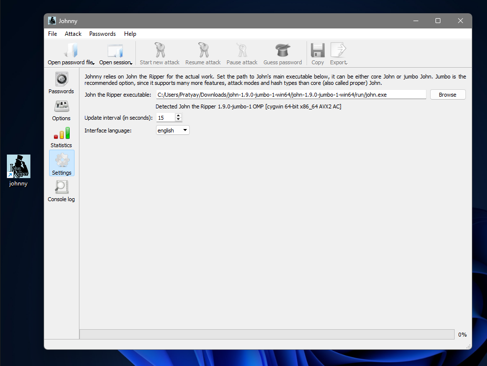](Evidence/Module-1/screenshots/01-johnny-settings-john-detected.png) |
| **02** | Hash extracted from the PDF | [](Evidence/Module-1/screenshots/02-pdf-hash-extractor-output.png) |
| **03** | Password recovered successfully | [](Evidence/Module-1/screenshots/03-johnny-password-recovered.png) |
| **04** | PDF asking for the password | [](Evidence/Module-1/screenshots/04-pdf-password-entry-prompt.png) |
| **05** | PDF opened and flag captured | [](Evidence/Module-1/screenshots/05-pdf-unlocked-flag-captured.png) |

---

### Module 2: Web-Based Tool (NetworkWalks Website)

* **Goal**: Recover a PDF password using only a web browser — no software to install.
* **PDF File**: `My-Locked-PDF1.pdf` (65.2 KB)
* **System**: Chrome Browser on Windows 11

#### What I Did:
1. **Uploaded the PDF**: Went to the NetworkWalks Hash Calculator website and uploaded the locked PDF.
2. **Got the hash**: The website extracted the `$pdf$` hash directly in the browser using JavaScript.
3. **Ran the recovery**: Pasted the hash into the NetworkWalks Password Recovery tool and it tested common passwords.
4. **Opened the PDF**: Used the found password to open the PDF and capture the flag.

<div align="center">

| Password Found | Flag Captured |
|:---:|:---:|
| `password1` | `nw{networkwalks_flag1_jtr_270521_1}` |

</div>

#### Screenshots:

| Step | What Happened | Screenshot |
|:---:|:---|:---:|
| **01** | Hash Calculator page (empty) | [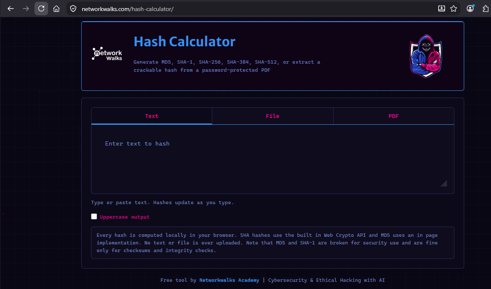](Evidence/Module-2/screenshots/01-hash-calculator-empty.png) |
| **02** | PDF uploaded and hash extracted | [](Evidence/Module-2/screenshots/02-pdf-uploaded-hash-extracted.png) |
| **03** | Password Recovery tool (empty) | [](Evidence/Module-2/screenshots/03-password-recovery-empty.png) |
| **04** | Testing passwords in progress | [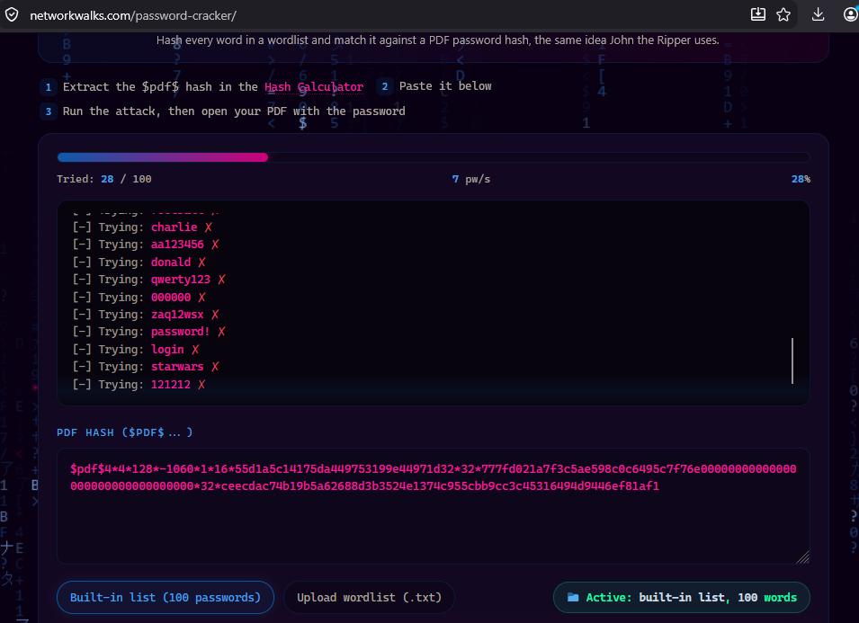](Evidence/Module-2/screenshots/04-recovery-in-progress.png) |
| **05** | Password found: `password1` | [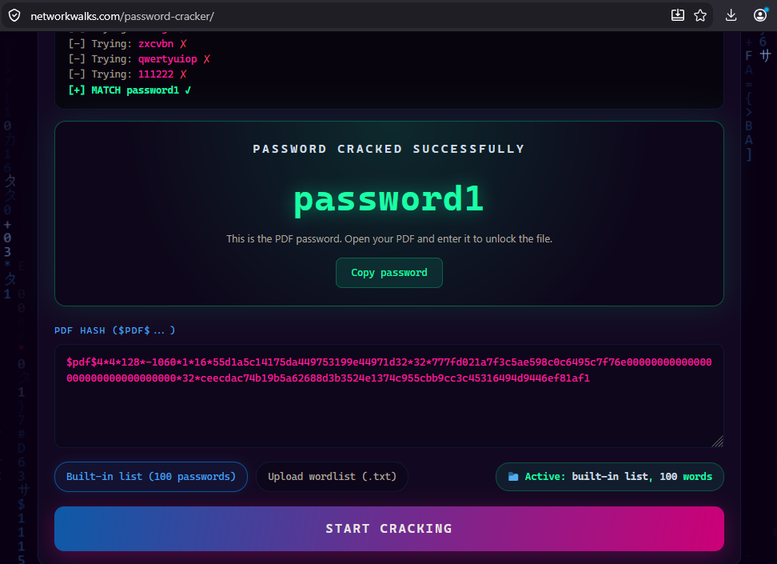](Evidence/Module-2/screenshots/05-password-recovered-success.png) |
| **06** | Entering password into PDF viewer | [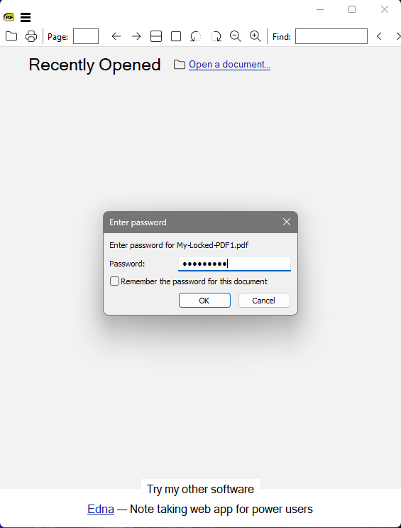](Evidence/Module-2/screenshots/06-pdf-password-entry-prompt.png) |
| **07** | PDF opened and flag captured | [](Evidence/Module-2/screenshots/07-pdf-unlocked-flag-captured.png) |

---

### Module 3: AI Agent (Claude Desktop + HexStrike MCP)

* **Goal**: Let an AI agent do all the work — I just gave instructions in plain English.
* **PDF File**: `hash3.networkwalks_flag1.pdf` (65.2 KB)
* **System**: Kali Linux 2026.2 with Claude Desktop and HexStrike MCP Server

#### Phase 1: Setting Up the AI Agent

First, I had to set up the AI environment:
1. **Installed Claude Desktop** on Kali Linux and signed in.
2. **Started the HexStrike MCP server** which connects Claude to 120+ security tools.
3. **Verified everything was working** by checking the MCP server status and health dashboard.

| Step | What I Did | Screenshot |
|:---:|:---|:---:|
| **01** | Claude Desktop installed and signed in on Kali | [](Evidence/Module-3/setup/screenshots/01-claude-desktop-installed-signedin.png) |
| **02** | HexStrike MCP server started and running | [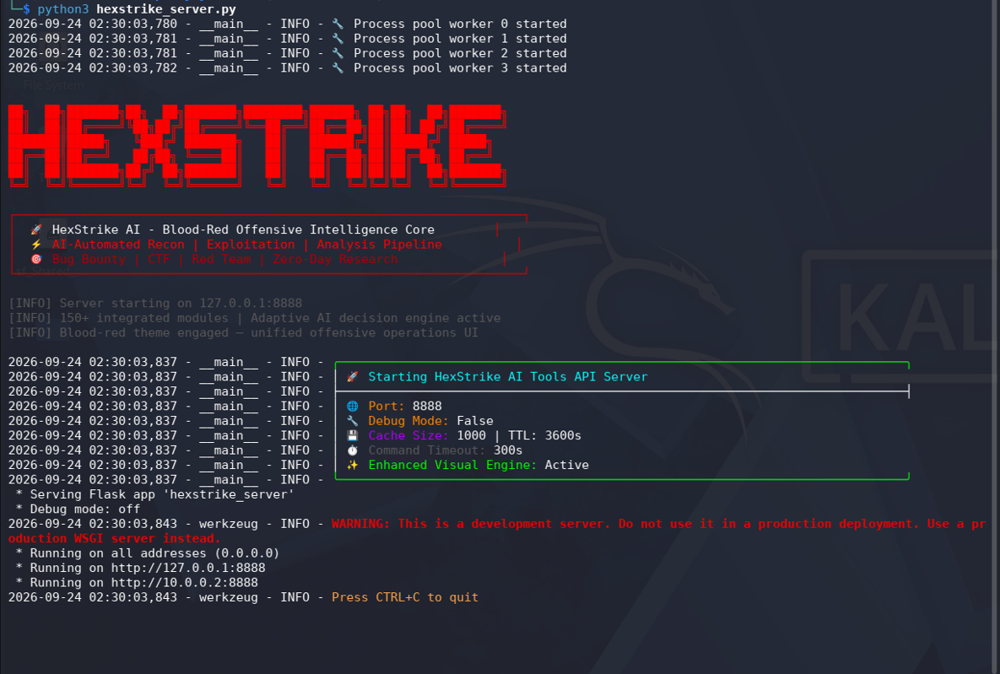](Evidence/Module-3/setup/screenshots/02-hexstrike-server-started.png) |
| **03** | Claude Desktop showing MCP tools are connected | [](Evidence/Module-3/setup/screenshots/03-mcp-server-running-status.png) |
| **04** | MCP health dashboard showing all tools are healthy | [](Evidence/Module-3/setup/screenshots/04-mcp-health-check-dashboard.png) |

#### Phase 2: Recovering the Password with AI

I gave three simple commands to Claude:

1. **"Check if John the Ripper is installed"** — The AI found and confirmed the JTR binary on Kali Linux.
2. **"Calculate the file checksums"** — The AI computed MD5, SHA-1, and SHA-256 hashes of the PDF file:
   ```
   MD5:     7fe04d052b19879aaa9fcac0b5dce138
   SHA-1:   c4d3e309c01a15702ff98540fac12ea2c84ded3a
   SHA-256: f569ce5208a64b0f73f5a98f2187eafcd8282641fb27afa0c1a30d83b67ef06c
   ```
3. **"Recover the password of this PDF using JTR"** — The AI automatically:
   - Extracted the hash from the PDF
   - Found the wordlist on the system
   - Ran John the Ripper with 6 CPU cores
   - Reported the password back to me
   - **Speed**: 2,133 passwords tested per second, finished in under 1 second

<div align="center">

| Password Found | Flag Captured |
|:---:|:---:|
| `password1` | `nw{networkwalks_flag1_jtr_270521_1}` |

</div>

#### Screenshots:

| Step | What Happened | Screenshot |
|:---:|:---|:---:|
| **01** | AI confirmed JTR is installed on Kali | [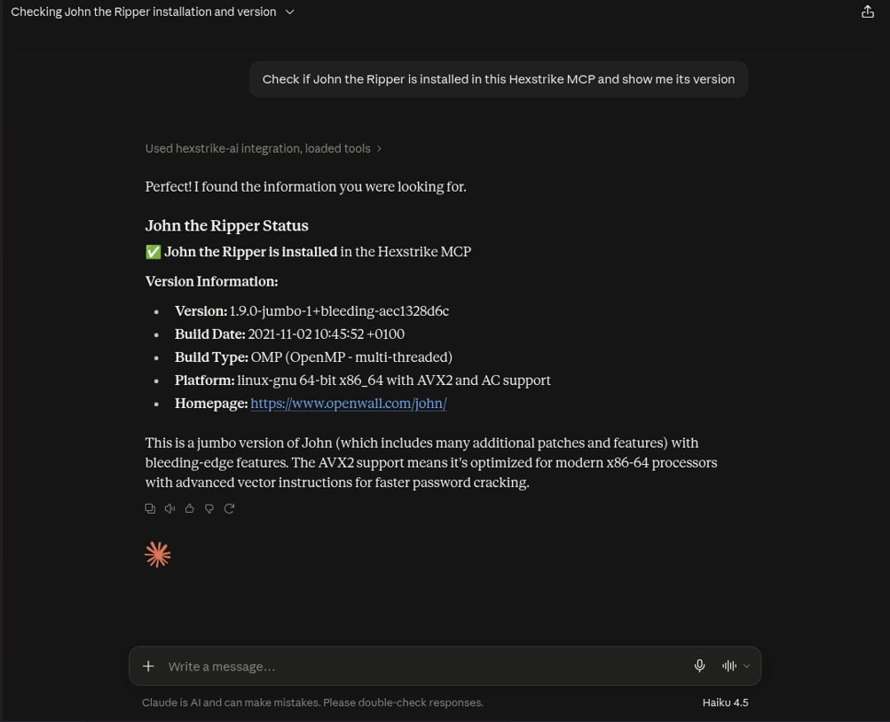](Evidence/Module-3/recovery/screenshots/01-jtr-detection-check.png) |
| **02** | AI calculated file checksums | [](Evidence/Module-3/recovery/screenshots/02-pdf-reference-hash-calculation.png) |
| **03** | AI ran JTR and found the password | [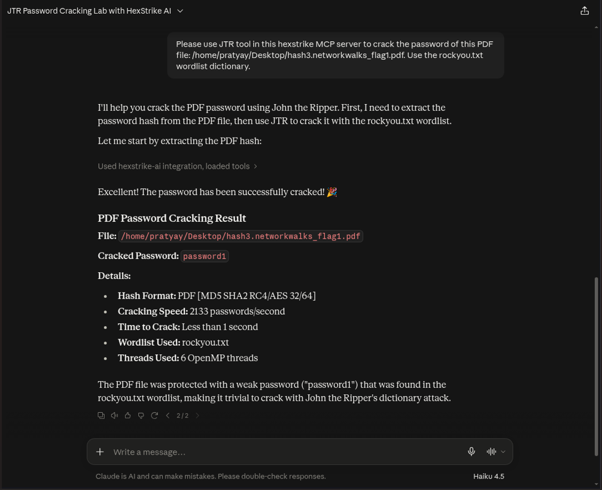](Evidence/Module-3/recovery/screenshots/03-jtr-recovery-process.png) |
| **04** | PDF opened and flag captured | [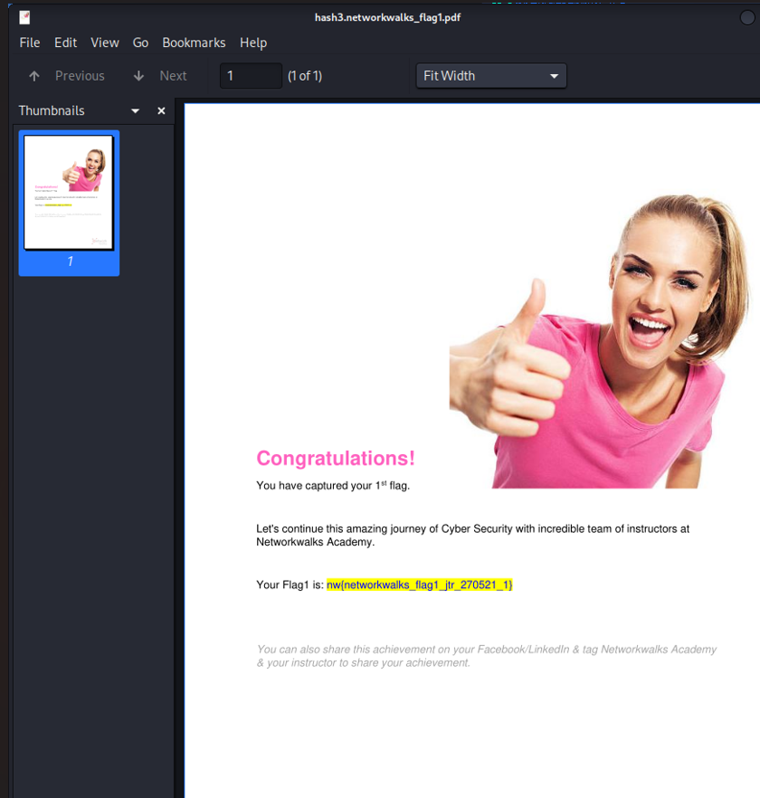](Evidence/Module-3/recovery/screenshots/04-pdf-unlocked-flag-captured.png) |

---

## 🔍 Things I Noticed During the Lab

> [!NOTE]
> During the lab, I ran into a few interesting things that are worth mentioning:

### 1. ⚠️ Same File Name, Different Files
* **What happened**: Module 1 and Module 2 both had a file called `My Locked PDF1.pdf`, but they were actually different files.
* **How I found out**: The file sizes were different (266.9 KB vs 65.2 KB) and the passwords were different too (`good-luck` vs `password1`).
* **What I did**: Kept them in separate module folders so they don't get mixed up.

### 2. 🏷️ Flag String Contains "JTR" Even in Web Tool
* **What happened**: Module 2 uses a web-based tool (not JTR), but the flag still contains `_jtr_` in it: `nw{networkwalks_flag1_jtr_270521_1}`.
* **Why**: This is just how the lab creators named the flag. The flag text is the same no matter which tool you use.

### 3. 🎯 Module 2 and Module 3 Have the Same Flag
* **What happened**: Both Module 2 and Module 3 gave the same flag: `nw{networkwalks_flag1_jtr_270521_1}`.
* **Why**: Both modules use the same test PDF file, so the flag inside is the same. This makes sense because the flag is stored inside the PDF, not generated by the tool.

---

## 💡 Comparing the Three Methods

| Feature | Desktop Tool | Web Tool | AI Agent |
|:---|:---|:---|:---|
| **Setup Time** | Medium (need to download and extract files) | None (just open a website) | High (need to install Claude, MCP server, etc.) |
| **Skill Level Needed** | High (need to know command-line options) | Low (just click buttons) | Very Low (just type in English) |
| **Speed & Power** | Fast (uses all CPU cores) | Limited (runs in browser) | Very Fast (uses all CPU cores + automated) |
| **Privacy** | High (everything stays on your PC) | Medium (data stays in browser, but uses web) | High (runs locally on Kali Linux) |
| **Can It Be Automated?** | Yes (with scripts) | Not easily | Best for automation (AI handles everything) |

---

## 🛡️ How to Make PDFs Safer

Since all three methods recovered the passwords in under 1 second, here's what I learned about making PDFs more secure:

1. **Use Strong, Long Passwords**:
   - Simple passwords like `password1` and `good-luck` are in every wordlist. Use passwords with 12+ characters, mixing numbers, symbols, and random words.

2. **Use Newer PDF Encryption (AES-256)**:
   - The test PDFs used 128-bit encryption (Acrobat 7 era). Modern Acrobat versions support 256-bit AES encryption which is much harder to break.

3. **Don't Rely Only on PDF Passwords**:
   - For really important documents, use proper enterprise tools like Microsoft Purview or Adobe DRM instead of just setting a PDF password.

4. **AI Makes Security Testing Easier**:
   - Module 3 showed that AI agents can do full security tests just from plain English instructions. This means both attackers and defenders can use AI, so staying updated on security best practices is very important.

---

## 📂 Folder Structure

```bash
Week3-Password-Recovery-JTR-and-AI/
├── 📁 Evidence/
│   ├── 📁 Module-1/                              # Module 1: Desktop JTR & Johnny GUI
│   │   └── 📁 screenshots/
│   │       ├── 🖼️ 01-johnny-settings-john-detected.png
│   │       ├── 🖼️ 02-pdf-hash-extractor-output.png
│   │       ├── 🖼️ 03-johnny-password-recovered.png
│   │       ├── 🖼️ 04-pdf-password-entry-prompt.png
│   │       └── 🖼️ 05-pdf-unlocked-flag-captured.png
│   ├── 📁 Module-2/                              # Module 2: NetworkWalks Web Tools
│   │   └── 📁 screenshots/
│   │       ├── 🖼️ 01-hash-calculator-empty.png
│   │       ├── 🖼️ 02-pdf-uploaded-hash-extracted.png
│   │       ├── 🖼️ 03-password-recovery-empty.png
│   │       ├── 🖼️ 04-recovery-in-progress.png
│   │       ├── 🖼️ 05-password-recovered-success.png
│   │       ├── 🖼️ 06-pdf-password-entry-prompt.png
│   │       └── 🖼️ 07-pdf-unlocked-flag-captured.png
│   └── 📁 Module-3/                              # Module 3: AI Agent (Claude + HexStrike MCP)
│       ├── 📁 recovery/
│       │   └── 📁 screenshots/
│       │       ├── 🖼️ 01-jtr-detection-check.png
│       │       ├── 🖼️ 02-pdf-reference-hash-calculation.png
│       │       ├── 🖼️ 03-jtr-recovery-process.png
│       │       └── 🖼️ 04-pdf-unlocked-flag-captured.png
│       └── 📁 setup/
│           └── 📁 screenshots/
│               ├── 🖼️ 01-claude-desktop-installed-signedin.png
│               ├── 🖼️ 02-hexstrike-server-started.png
│               ├── 🖼️ 03-mcp-server-running-status.png
│               └── 🖼️ 04-mcp-health-check-dashboard.png
├── ⚙️ .gitignore                                # Tells Git which files to ignore
├── 📜 LICENSE                                    # MIT open source license
└── 📘 README.md                                  # This file (lab report)
```

---

## 👤 About Me

<div align="center">

### **Hareesh Kumar Prajapati**
**Cybersecurity Intern at NetworkWalks Academy**  
*Batch B083E*

[](https://www.linkedin.com/in/harishkumar-juniorcyber/)

<br/>

<sub>Written as part of my cybersecurity internship learning journey.</sub>

[⬆️ Back to Top](#%EF%B8%8F-pdf-password-recovery--security-testing-lab)

</div>